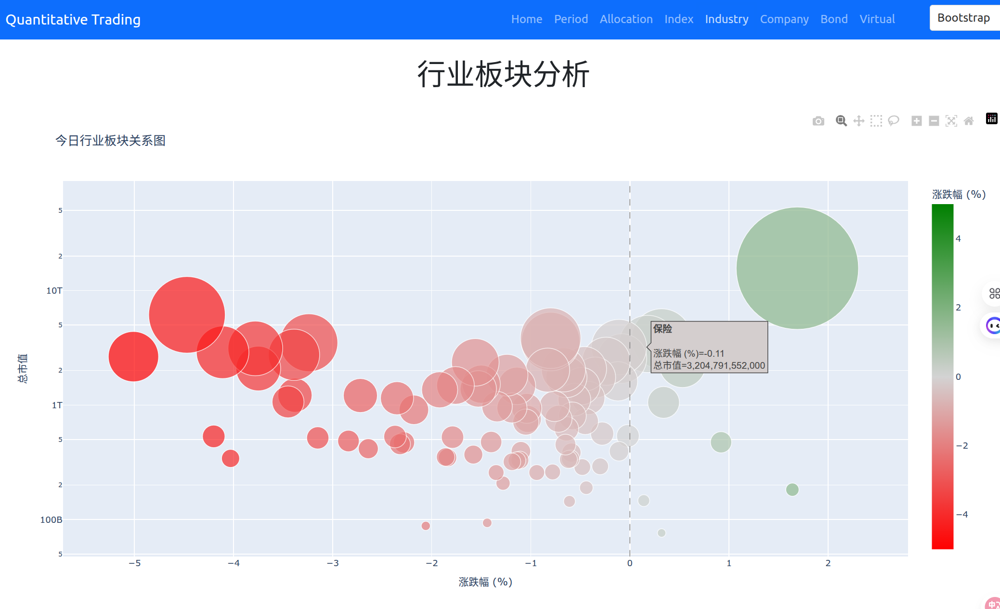
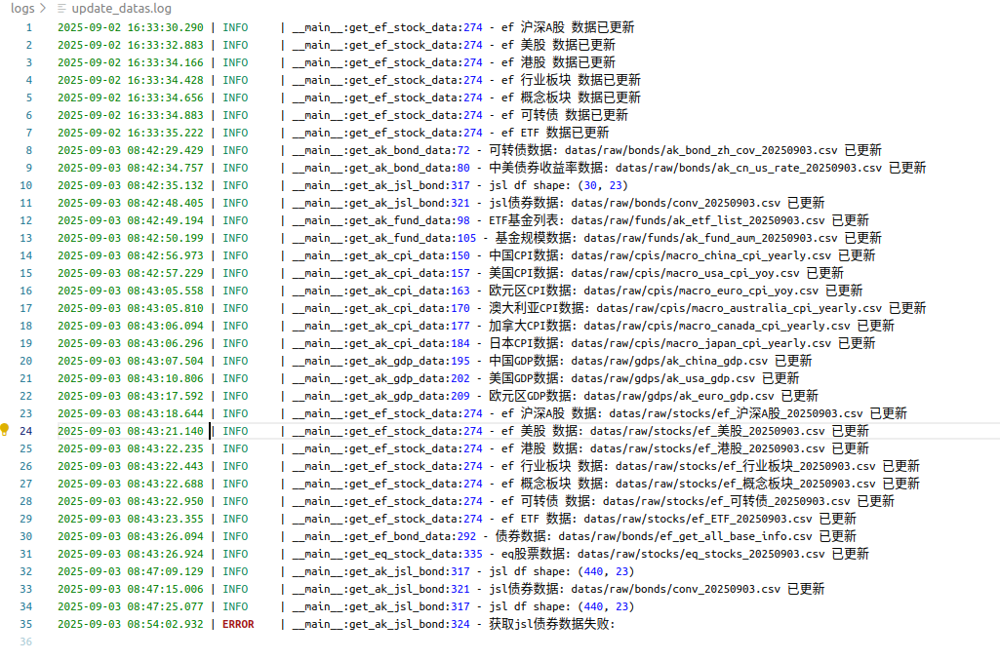

# Quantitative Trading System 🚀

[](https://www.python.org/)
[](LICENSE)
[](https://dash.plotly.com/)
[](https://streamlit.io/)

A powerful quantitative trading system supporting multi-asset analysis, various investment strategies, and interactive web visualization.

## 📖 Introduction

quantitative_trading is a Python-based quantitative trading platform that integrates data collection, strategy analysis, backtesting, and visualization capabilities. The system supports multiple asset classes including stocks, bonds, funds, cryptocurrencies, and provides core investment strategies such as valuation strategies, trend following, and large/small cap rotation.

### Core Features
- **Fundamental Analysis**: Funds, stocks, REITS, real-time market data analysis
- **Technical Analysis**: Trading signal generation, backtesting framework
- **Multi-Asset Support**: Comprehensive coverage of stocks, bonds, funds, cryptocurrencies
- **Smart Alerts**: Custom watchlists and alert settings

## ✨ Features

### 📊 Multi-Asset Support
- **Stock Indices**: Global major indices (CSI 300, S&P 500, NASDAQ, etc.)
- **Bonds**: Convertible bonds, government bonds, corporate bonds analysis
- **Cryptocurrencies**: Bitcoin, Ethereum, and other major cryptocurrencies
- **Funds**: ETF, index funds analysis
- **Macro Economics**: CPI, GDP, unemployment rate, and other economic indicators

### 🎯 Investment Strategy Engine
- **Valuation Strategy**: Value investing based on PE/PB percentiles
- **Trend Following**: Moving average system trend analysis (20-day/60-day)
- **Large/Small Cap Rotation**: Relative strength analysis between CSI 300 and CSI 500
- **Smart DCA**: Dynamic dollar-cost averaging with adjustable amounts
- **Economic Cycle**: Asset allocation based on Merrill Lynch clock model

### 📈 Data Visualization
- **Dash Web App**: Multi-page interactive data analysis platform
- **Streamlit App**: Rapid prototyping and data exploration
- **Real-time Charts**: Dynamically updated candlestick charts, technical indicators
- **Theme Switching**: Support for multiple Bootstrap themes

### 🔧 Data Processing Capabilities
- **Data Collection**: Multiple data sources (akshare, efinance, tushare, yfinance, etc.)
- **Data Cleaning**: Automated data preprocessing and standardization
- **Data Storage**: Structured storage for raw and processed data
- **Data Updates**: Scheduled tasks for automatic data updates

## 📊 Data Description

### Data Sources
- **akshare**: Chinese stocks, funds, bonds data
- **efinance**: Real-time market data
- **tushare**: Historical market data
- **yfinance**: Overseas market data
- **Official Statistics**: Macroeconomic data

<!-- ## 🎯 Investment Strategies

### 1. Valuation Strategy
Based on historical PE/PB percentiles:
- **Undervalued** (percentile ≤ 30%): Buy recommendation
- **Fair Value** (30% < percentile < 70%): Hold recommendation
- **Overvalued** (percentile ≥ 70%): Reduce recommendation

### 2. Trend Following Strategy
Using dual moving average system (20-day/60-day):
- **Golden Cross** (short above long): Buy signal
- **Death Cross** (short below long): Sell signal
- **Trend Strength**: Relative strength indicator calculation

### 3. Large/Small Cap Rotation Strategy
Analyzing relative performance between CSI 300 vs CSI 500:
- **Large Cap Strong**: Overweight CSI 300 (70%)
- **Small Cap Strong**: Overweight CSI 500 (70%)
- **Balanced**: Equal allocation (50% each)

### 4. Smart DCA Strategy
Dynamic adjustment of investment amount considering:
- **Valuation Factor**: Lower valuation, more investment
- **Trend Factor**: Rising trend increases investment
- **Volatility Factor**: High volatility reduces investment -->

## 🎯 Examples

### Economic Cycle


### Asset Allocation


### Indices


### Industry



### Cryptocurrency


### Updatedata



## 🌐 Web Application Guide

### Dash Application Features
- **Home**: System overview and quick navigation
- **Cycle Analysis**: Economic cycle identification and asset allocation
- **Asset Allocation**: Portfolio optimization and rebalancing
- **Index Analysis**: Global indices valuation and trend analysis
- **Industry Analysis**: Industry rotation and sentiment analysis
- **Bond Analysis**: Convertible bonds, interest rate bonds analysis
- **Cryptocurrency**: Cryptocurrency market analysis

### Theme Switching
Support for 20 Bootstrap themes including:
- Light Themes: Bootstrap, Cerulean, Flatly, Journal, etc.
- Dark Themes: Cyborg, Darkly, Slate, Solar, etc.

## 🚀 Quick Start

### Environment Requirements
- Python 3.11+
- pip 20.0+

### Installation Steps

1. **Clone the Project**
```bash
git clone git@github.com:zhenda-hub/quantitative_trading.git
cd quantitative_trading
```

2. **Create Virtual Environment**
```bash
python -m venv .venv
source .venv/bin/activate  # Linux/Mac
# or
.venv\Scripts\activate     # Windows
```

3. **Install Dependencies**

Using `pip-tools` for dependency management:
```bash
pip install pip-tools
pip-compile requirements.in    # Compile dependencies
pip-sync requirements.txt      # Sync dependencies
# pipdeptree                     # View dependency tree
```

4. **Configure Environment Variables**
```bash
cp .envExample .env
# Edit .env file to configure parameters
```

### Run Applications

**Run Dash Web Application:**
```bash
python -m dash_web.app
```

Visit http://localhost:8050

### Data Updates

Use scheduled tasks to update data:
```bash
python -m utils.update_datas
```

## 🤝 Contributing

Welcome to contribute code! Please follow these steps:

1. **Fork the project**
2. **Create a feature branch**
   ```bash
   git checkout -b feature/AmazingFeature
   ```
3. **Commit your changes**
   ```bash
   git commit -m 'Add some AmazingFeature'
   ```
4. **Push to the branch**
   ```bash
   git push origin feature/AmazingFeature
   ```
5. **Open a Pull Request**

### Development Guide
- Use `loguru` for log management, log files are saved in `logs/` directory
- Data updates use: `python utils/update_datas.py`
- Follow PEP8 code style guidelines

## ❓ Issue Reporting

If you encounter any issues or have improvement suggestions:

1. **Check Documentation**: First read this documentation carefully
2. **Search Issues**: Search for related issues in [GitHub Issues](https://github.com/zhenda-hub/quantitative_trading/issues)
3. **Create New Issue**: If the issue hasn't been raised, create a new issue with detailed description
4. **Contact Maintainer**: Contact project maintainer via email

**Priority Handling**:
- Clear error description and reproduction steps
- Feature improvement suggestions
- Documentation improvement suggestions

## 📄 License

This project is licensed under the **MIT License** - see the [LICENSE](LICENSE) file for details.

MIT License allows you to freely use, copy, modify, merge, publish, distribute, sublicense, and sell copies of the software, provided that you include the original copyright license notice in the copies.

## 🙏 Acknowledgments

Thanks to the following open source projects and technologies:

- **[akshare](https://github.com/akfamily/akshare)**: Rich financial data interfaces
- **[Plotly](https://plotly.com/)**: Excellent visualization libraries supporting interactive charts
- **[Dash](https://dash.plotly.com/)**: Python-based web application framework
- **[pandas](https://pandas.pydata.org/)**: Powerful data analysis tools
<!-- - **[TA-Lib](https://ta-lib.org/)**: Technical analysis indicators library -->

Thanks to all contributors and users for support and feedback!

---

**Disclaimer**: This project is for learning and research purposes only and does not constitute investment advice. Investment involves risks, please be cautious. Users should bear the risks of investment decisions themselves.
