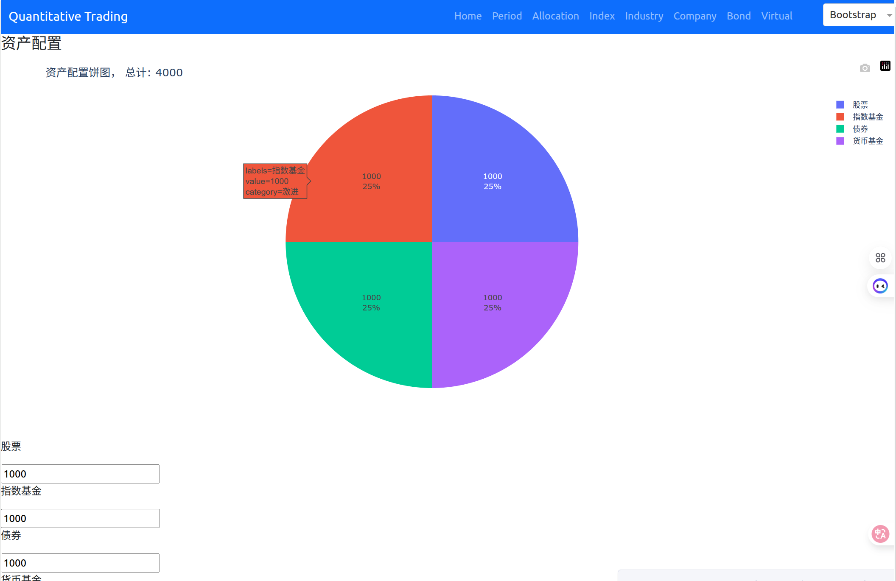
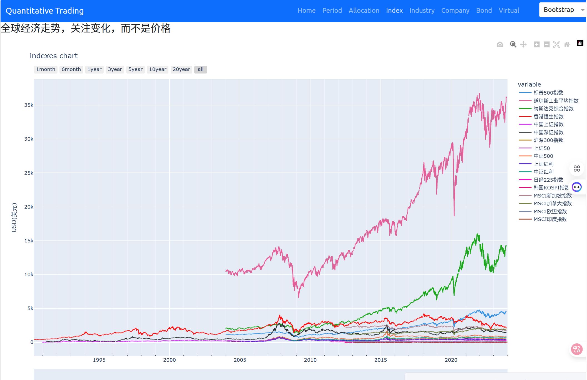

# Quantitative Trading System 🚀

[](https://www.python.org/)
[](LICENSE)
[](https://dash.plotly.com/)
[](https://streamlit.io/)

一个功能强大的量化交易系统，支持多资产类别分析、多种投资策略和可视化Web界面。

## 📖 介绍

quantitative_trading 是一个基于Python的量化交易平台，集成了数据采集、策略分析、回测和可视化功能。系统支持股票、债券、基金、虚拟货币等多种资产类别，提供估值策略、趋势跟踪、大小盘轮动等核心投资策略。

### 核心功能
- **基本面分析**: 基金、股票、REITS、实时行情数据分析
- **技术面分析**: 交易信号生成、回测框架
- **多资产支持**: 股票、债券、基金、虚拟货币全覆盖
- **智能提醒**: 自定义关注列表和提醒设置

## ✨ 特性

### 📊 多资产类别支持
- **股票指数**: 全球主要指数（沪深300、标普500、纳斯达克等）
- **债券**: 可转债、国债、企业债分析
- **虚拟货币**: 比特币、以太坊等主流加密货币
- **基金**: ETF、指数基金分析
- **宏观经济**: CPI、GDP、失业率等经济指标

### 🎯 投资策略引擎
- **估值策略**: 基于PE/PB分位数的价值投资
- **趋势跟踪**: 均线系统趋势判断（20日/60日均线）
- **大小盘轮动**: 沪深300 vs 中证500相对强度分析
- **智能定投**: 动态调整定投金额的定投策略
- **经济周期**: 美林时钟模型资产配置建议

### 📈 数据可视化
- **Dash Web应用**: 多页面交互式数据分析平台
- **Streamlit应用**: 快速原型开发和数据探索
- **实时图表**: 动态更新的K线图、技术指标图表
- **主题切换**: 支持20种Bootstrap主题

### 🔧 数据处理能力
- **数据采集**: 支持akshare、efinance、tushare、yfinance等多个数据源
- **数据清洗**: 自动化数据预处理和标准化
- **数据存储**: 结构化存储原始数据和加工数据
- **数据更新**: 定时任务自动更新数据

## 📊 数据描述

### 数据源
- **akshare**: 中国股票、基金、债券数据
- **efinance**: 实时市场数据
- **tushare**: 历史市场数据
- **yfinance**: 海外市场数据
- **官方统计数据**: 宏观经济数据

<!-- 
## 🎯 投资策略

### 1. 估值策略
基于历史PE/PB分位数：
- **低估** (分位数 ≤ 30%): 买入建议
- **合理估值** (30% < 分位数 < 70%): 持有建议
- **高估** (分位数 ≥ 70%): 减持建议

### 2. 趋势跟踪策略
使用双均线系统（20日/60日）：
- **金叉** (短周期上穿长周期): 买入信号
- **死叉** (短周期下穿长周期): 卖出信号
- **趋势强度**: 相对强弱指标计算

### 3. 大小盘轮动策略
分析沪深300与中证500的相对表现：
- **大盘强势**: 超配沪深300 (70%)
- **小盘强势**: 超配中证500 (70%)
- **均衡**: 等权重配置 (各50%)

### 4. 智能定投策略
动态调整投资金额，考虑：
- **估值因子**: 估值越低，投资越多
- **趋势因子**: 上升趋势增加投资
- **波动率因子**: 高波动率减少投资 -->

## 🎯 示例

### 经济周期


### 资产配置



### 指数



### 行业


### 虚拟货币


### 更新数据


## 🌐 Web应用指南

### Dash应用功能
- **首页**: 系统概览和快速导航
- **周期分析**: 经济周期识别和资产配置
- **资产配置**: 组合优化和再平衡
- **指数分析**: 全球指数估值和趋势分析
- **行业分析**: 行业轮动和情绪分析
- **债券分析**: 可转债、利率债分析
- **加密货币**: 加密货币市场分析

### 主题切换
支持20种Bootstrap主题，包括：
- 浅色主题: Bootstrap, Cerulean, Flatly, Journal 等
- 深色主题: Cyborg, Darkly, Slate, Solar 等

## 🚀 快速开始

### 环境要求
- Python 3.11+
- pip 20.0+

### 安装步骤

1. **克隆项目**
```bash
git clone git@github.com:zhenda-hub/quantitative_trading.git
cd quantitative_trading
```

2. **创建虚拟环境**
```bash
python -m venv .venv
source .venv/bin/activate  # Linux/Mac
# 或
.venv\Scripts\activate     # Windows
```

3. **安装依赖**

使用 `pip-tools` 进行依赖管理：
```bash
pip install pip-tools
pip-compile requirements.in    # 编译依赖
pip-sync requirements.txt      # 同步依赖
# pipdeptree                     # 查看依赖树
```

4. **配置环境变量**
```bash
cp .envExample .env
# 编辑.env文件配置相关参数
```

### 运行应用

**运行Dash Web应用：**
```bash
python -m dash_web.app
```

访问 http://localhost:8050

### 数据更新

使用定时任务更新数据：
```bash
python -m utils.update_datas
```

## 🤝 参与贡献

欢迎贡献代码！请遵循以下步骤：

1. **Fork 本项目**
2. **创建特性分支**
   ```bash
   git checkout -b feature/AmazingFeature
   ```
3. **提交更改**
   ```bash
   git commit -m 'Add 新特性'
   ```
4. **推送到分支**
   ```bash
   git push origin feature/AmazingFeature
   ```
5. **开启Pull Request**

### 开发指南
- 使用 `loguru` 进行日志管理，日志文件保存在 `logs/` 目录
- 数据更新使用：`python utils/update_datas.py`
- 遵循PEP8代码规范

## ❓ 问题反馈

如果您在使用过程中遇到任何问题或有改进建议：

1. **查看文档**: 首先请仔细阅读本文档
2. **搜索Issues**: 在 [GitHub Issues](https://github.com/zhenda-hub/quantitative_trading/issues) 中搜索相关问题
3. **新建Issue**: 如果问题未被提出，请新建Issue并详细描述问题
4. **联系维护者**: 通过邮箱联系项目维护者

**优先处理**:
- 明确的错误描述和重现步骤
- 功能改进建议
- 文档改进建议

## 📄 许可证

本项目采用 **MIT 许可证** - 查看 [LICENSE](LICENSE) 文件了解详情。

MIT许可证允许您自由地使用、复制、修改、合并、出版发行、散布、再授权及售卖本软件，只需在副本中包含原始版权许可证声明。

## 🙏 致谢

感谢以下开源项目和技术：

- **[akshare](https://github.com/akfamily/akshare)**: 提供丰富的金融数据接口
- **[Plotly](https://plotly.com/)**: 优秀的可视化库，支持交互式图表
- **[Dash](https://dash.plotly.com/)**: 基于Python的Web应用框架
- **[pandas](https://pandas.pydata.org/)**: 强大的数据分析工具
<!-- - **[TA-Lib](https://ta-lib.org/)**: 技术分析指标库 -->

感谢所有贡献者和用户的支持与反馈！

---

**免责声明**: 本项目仅用于学习和研究目的，不构成投资建议。投资有风险，入市需谨慎。使用者应自行承担投资决策的风险。
